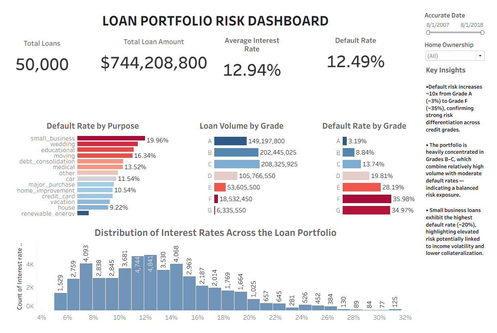

# Loan Portfolio Risk Dashboard (SQL + Tableau)

Live Dashboard:  
https://public.tableau.com/app/profile/sebastian.solano.r./viz/Libro1_17747136964960/Dashboard1

End-to-end credit risk analysis project using **BigQuery (SQL)** and **Tableau**.

This project simulates a real-world workflow for analyzing a consumer lending portfolio, focusing on default risk, portfolio segmentation, and data-driven insights.

---

## Objective

The goal of this project is to analyze a loan portfolio to:

- Measure overall portfolio risk  
- Identify high-risk borrower segments  
- Understand risk distribution across credit grades  
- Support data-driven decision making in credit risk management

---

## Tools & Technologies

- Google BigQuery — data storage and SQL analysis  
- SQL — data cleaning, transformation, and KPI calculation  
- Tableau Public — data visualization and dashboard development

---

## Project Structure

```text
loan-portfolio-risk-dashboard/

data/
    credit_risk_dataset.csv

sql/
    data_cleaning.sql
    portfolio_analysis.sql

tableau/
    loan_portfolio_dashboard.twbx
    loan_portfolio_dashboard.png

README.md

LICENSE
```

---

## Dataset

Source:

https://gist.github.com/eversonm/3d2b3cf0cd4b3c93f906377bba8f989c

Target variable:

`loan_status`

Used to derive:

`default_flag`

---

## Data Cleaning & Preparation

Data preparation was performed in BigQuery.

Key steps included:

- Filtering invalid records  
- Converting `issue_d` from STRING to DATE using `PARSE_DATE`
- Casting `int_rate` to numeric format  
- Creating `default_flag`
- Building clean analytical table `loans_clean`

---

## Key Metrics (KPIs)

KPIs were calculated using SQL in BigQuery and visualized in Tableau.

Core metrics:

- Total number of loans  
- Total loan amount  
- Average interest rate  
- Portfolio default rate  

Segment-level metrics:

- Default rate by loan purpose  
- Default rate by credit grade  
- Loan volume by grade  

---

## Dashboard Overview

Live Dashboard:  
https://public.tableau.com/app/profile/sebastian.solano.r./viz/Libro1_17747136964960/Dashboard1



The dashboard includes:

- KPI summary  
- Default rate by purpose  
- Default rate by credit grade  
- Loan volume by credit grade  
- Interest rate distribution  
- Interactive filters  

---

## Key Insights

- Default risk increases ~10x from Grade A (~3%) to Grade F (~35%)

- Portfolio is concentrated in Grades B–C, suggesting balanced risk exposure

- Small business loans show the highest default rates (~20%)

---

## Business Implications

- Credit grades strongly predict default risk  

- Portfolio concentration suggests controlled risk appetite  

- Certain loan purposes may require stricter underwriting  

---

## How to Reproduce

1. Load dataset into BigQuery  

2. Run:

```sql
sql/data_cleaning.sql
```

3. Run:

```sql
sql/portfolio_analysis.sql
```

4. Connect Tableau to BigQuery and build dashboard using:

`loans_clean`

---

## Author

Sebastian Solano  

*Economist & Data Analyst* [LinkedIn](https://www.linkedin.com/in/sebastian-solanor1/) | [Portfolio](https://github.com/sebastian-solanor1)
